### :memo: Let's meet
> 사용자 위치 정보를 기반으로 한 약속 장소 추천 및 모임 관리 서비스

### :date: 프로젝트 개요

- 진행기간 : 2021.01.11 ~ 2021.02.19
- 기획안

### :family: 팀원 

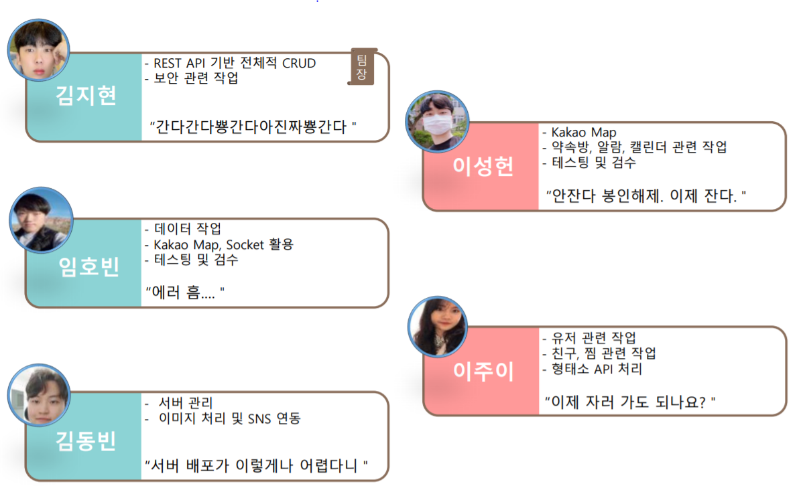

### :wrench: Tech Stack

- #### Tools

| Tool         | 기술                                                |
| ------------ | --------------------------------------------------- |
| GitLab       | 기능별 branch를 나눠서 코드 버전 관리               |
| Jira         | lssue 관리를 위해 Git 과 연동하여 사용, 스크럼 회의 |
| Scrum Pocker | Jira lssue 별 스프린트 시간 관리를 위한 용도        |
| Notion       | 개발 관련 자료들 저장, 회의록,  버그 관리           |
| AWS          | 배포                                                |

- #### Library

| Library     |                                           |
| ----------- | ----------------------------------------- |
| Vue.js      | Frontend 구현을 위한 JavaScript Framework |
| Spring-boot | Backend 구현을 위한 Java 기반 Framework   |

- #### Software Language

| Language   | 기술                      |
| ---------- | ------------------------- |
| Java       | Backend 구현 언어, 크롤링 |
| JavaScript | Frontend 구현 언어        |
| HTML / CSS | Frontend 구현 언어​​        |

#### :pencil2: 기획안 

- 와이어프레임 포함

### :star: 주요 기능

---------

- **일정 조율**
- 4-5명 이상인 단체인 경우에는 의견 조율하는데 어려움이 있음.
  
- 멤버들의 가능 날짜를 확인하고 직관적으로 가능한 날짜를 보여주어 일정 조율에 있어서 효율성을 높임.
  
- **중간 지점**
- 멤버들의 위치를 종합해 중간 지점을 알려주고 중간 지점의 반경 1km 의 주변 가게들을 추천해주는 기능
  
- **장소 추천**
- 중간 지점에 가장 가까운 핫플레이스 뿐만 아니라 멤버들 각각의 지역 주변의 장소들을 임의로 추천
  
- **추억 공유**
- 모임 완료 후 그날의 추억들을 공유하기 위해 약속 방에 추억 공유 탭을 추가하여 사진을 올린다.
  - 채팅방 내용을 기반으로 음식관련 데이터를 뽑아내여 형태소 분석을 통하여 장소 추천을 해준다.

### :eyes: ​페이지 소개

---------

- 메인페이지 

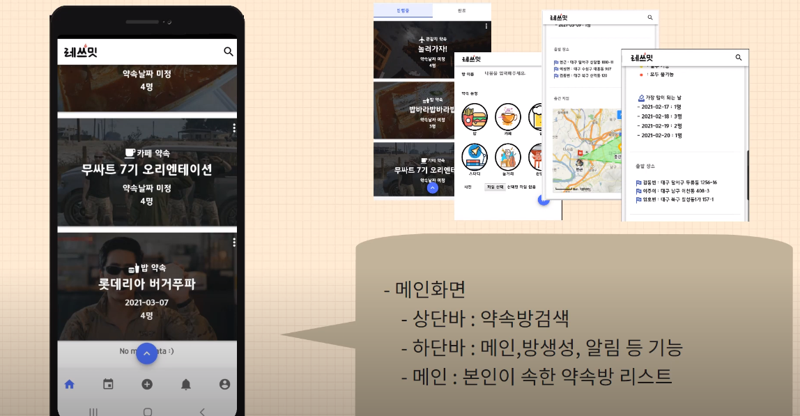

- 약속방 생성

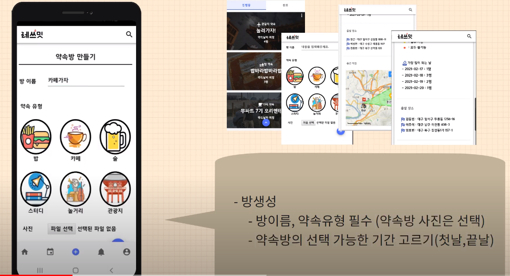

- 약속방 상세 페이지 - 약속 선택 

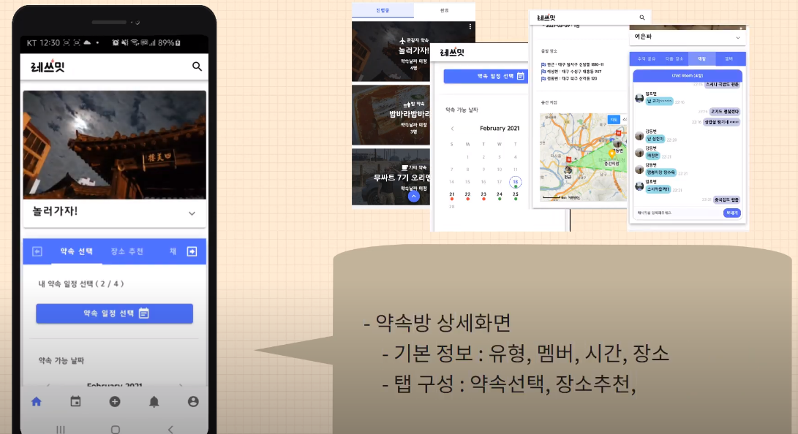

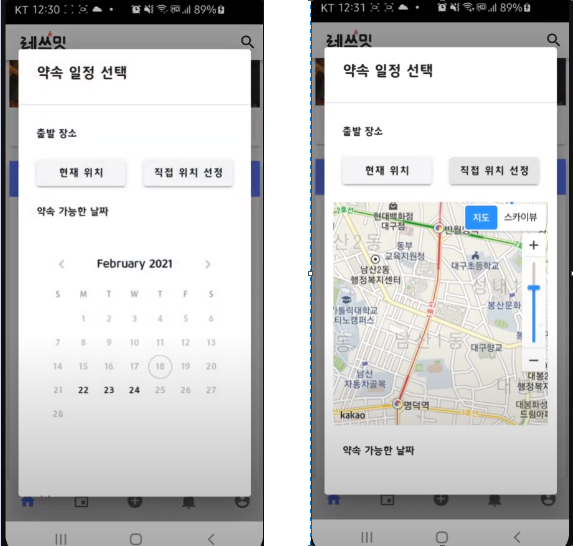

​	

약속 선택 후 멤버들 간의 일정 조율  

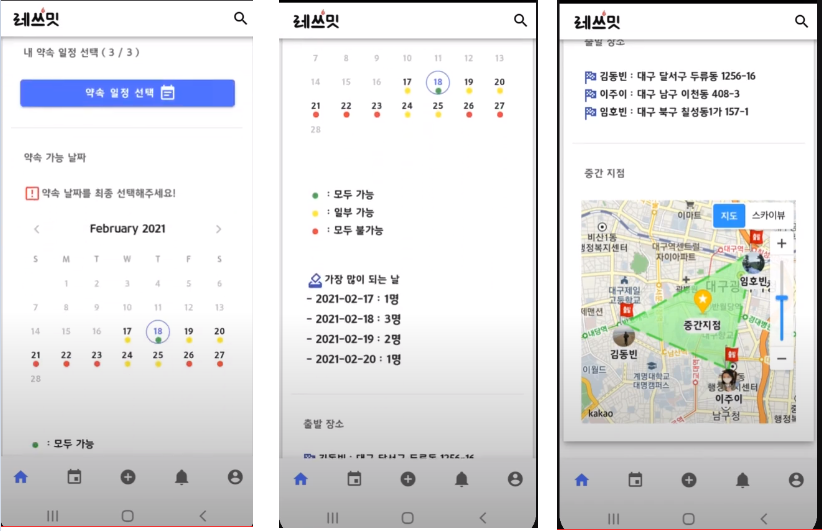

- 약속방 상세 페이지 - 장소 추천

  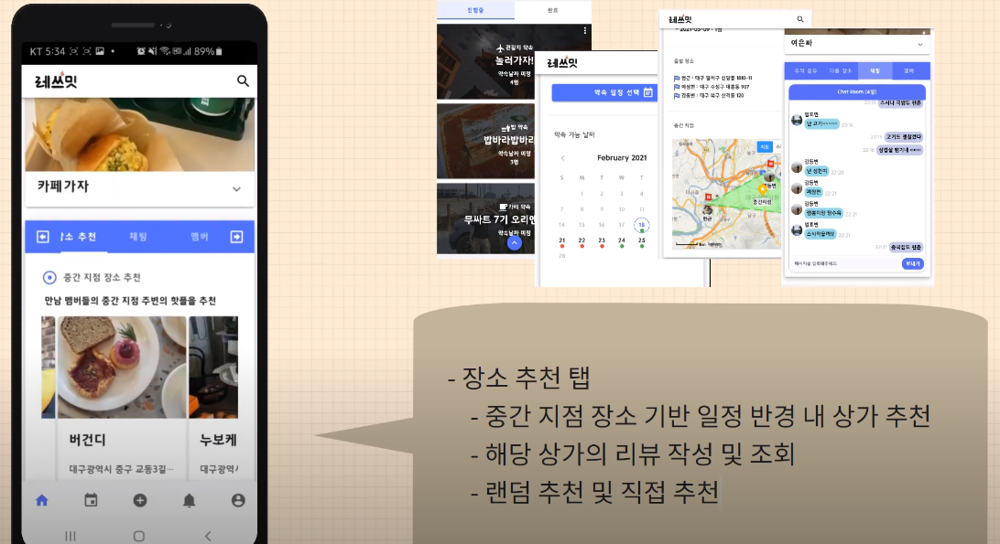

장소 상세 페이지를 보여주고 후기를 남길 수 있다.

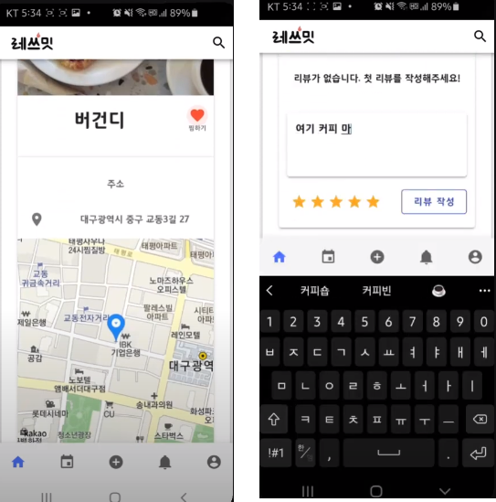

- 약속방 상세 페이지 - 채팅

- 약속방 상세 페이지 - 친구 추가

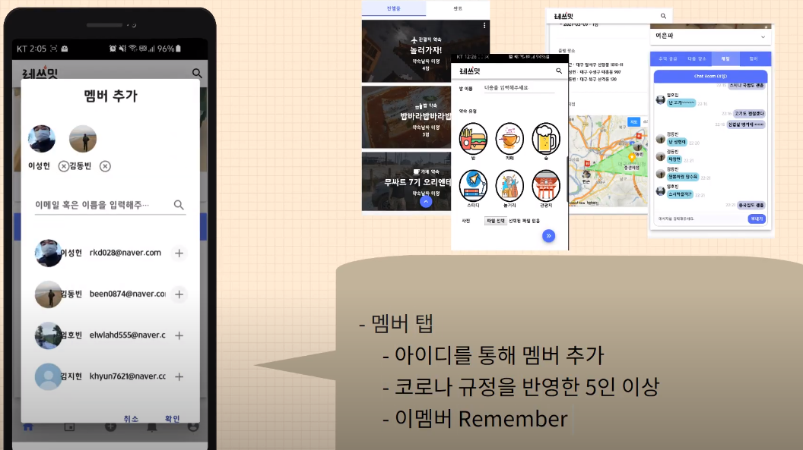

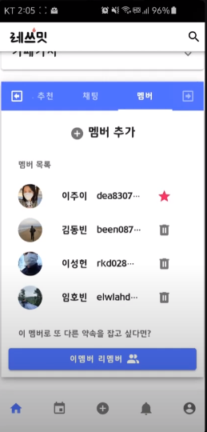

- 추억 공유 

  - 완료된 방에서 사진 공유

    

  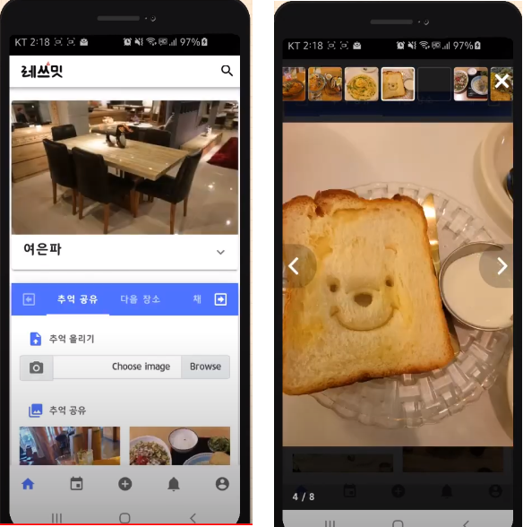

- 다음 장소 추천
  - 채팅방 내용을 기반으로 형태소 분석 
  - 언급이 많이 된 카테고리 추천
  - 랜덤 장소 추천

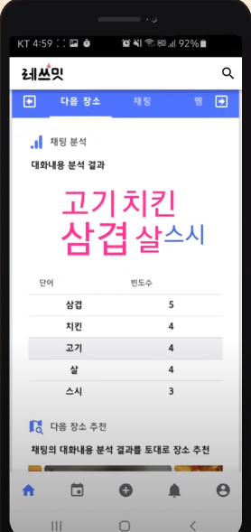

- 나의 일정 관리

  - 일정 클릭하면 해당 약속으로 이동 

  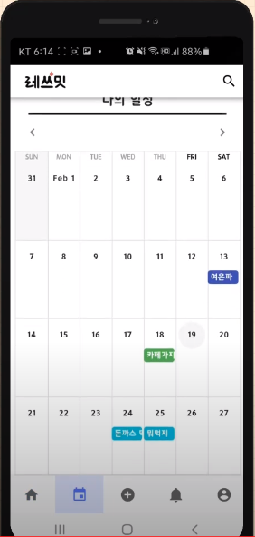

- 알람 기능
  - 약속방에 초대 되었을 때
  - 누군가가 나를 친구 추가를 하였을 때
  - 약속방 방장의 약속 확정이 필요할 때
  - 약속방 일정이 최종 확정 되었을 때 

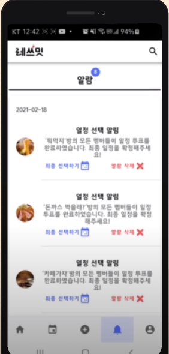

- 마이페이지

### 시연영상

https://www.youtube.com/watch?v=g1WlhsvUEDY